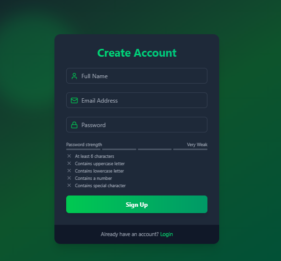
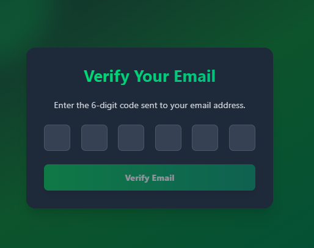
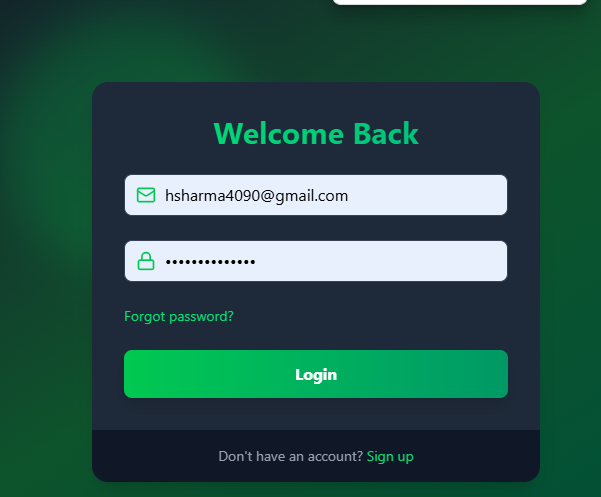
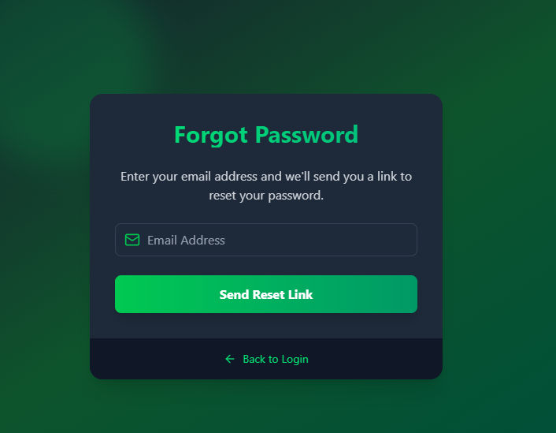
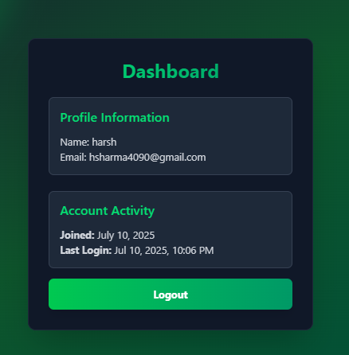

# 🔐 MERN Full Authentication App

A complete **Authentication System** built with the **MERN Stack (MongoDB, Express.js, React.js, Node.js)**. Includes secure user login, signup, logout, forgot password, and reset password functionalities.

---

## 🌐 Live Demo : [Click Here]()

---

## ✨ Features

- 📝 **User Signup** – Create an account using name, email, and password  
- 🔐 **Login** – Secure login with JWT-based authentication  
- 🚪 **Logout** – Instantly log out from the system  
- ❓ **Forgot Password** – Request password reset via email  
- 🔁 **Reset Password** – Securely update your password using token-based link  
- 🧠 **Session Management** – HTTP-only cookie for enhanced security  
- 📱 **Responsive Design** – Works smoothly on mobile, tablet, and desktop  

---

## 🛠️ Tech Stack

| Technology       | Description                  |
|------------------|------------------------------|
| **Frontend**     | React.js, Tailwind CSS       |
| **Backend**      | Node.js, Express.js          |
| **Database**     | MongoDB, Mongoose            |
| **Authentication** | JWT, Bcrypt, Cookies       |
| **Mail Service** | Mailtrap / Nodemailer        |
| **Environment**  | dotenv for config vars       |

---

## 📸 Screenshots
 

## ⚙️ Installation & Setup

# 1. Clone the repository
git clone https://github.com/Harsh091234/Mern-Full-Auth.git
cd Mern-Full-Auth

# 2. Install server and client dependencies
cd server
npm install

cd client
npm install

# 3. Create .env files in both /backend and /frontend folders
# Add necessary environment variables (PORT, MONGO_URI, JWT_SECRET, etc.)

# 4. Start the development server
# Run both frontend and backend (use two terminals)
cd server
npm start

cd client
npm run dev

